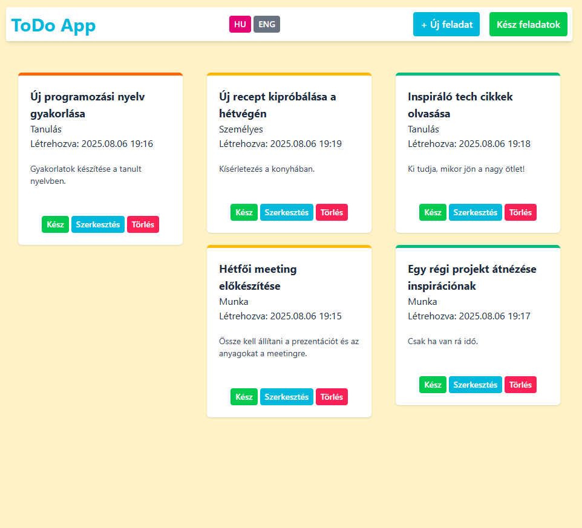
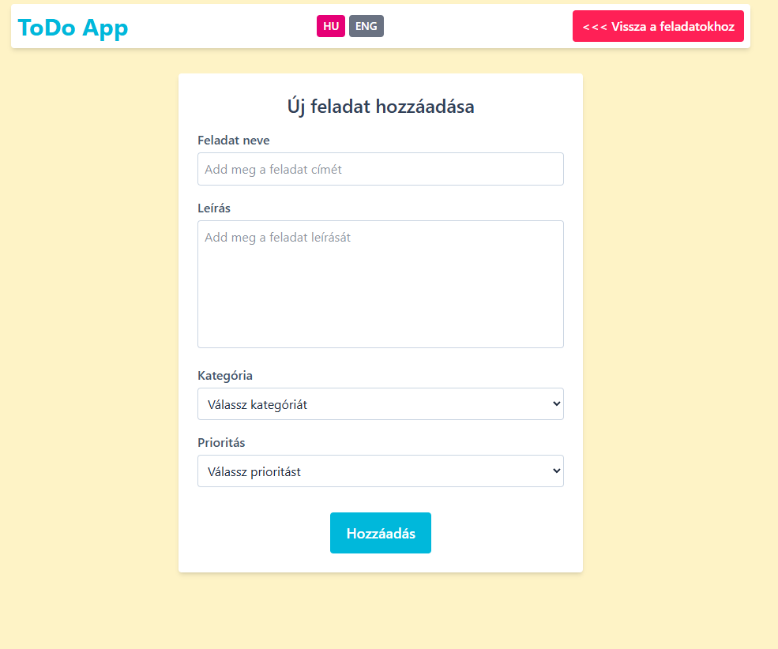
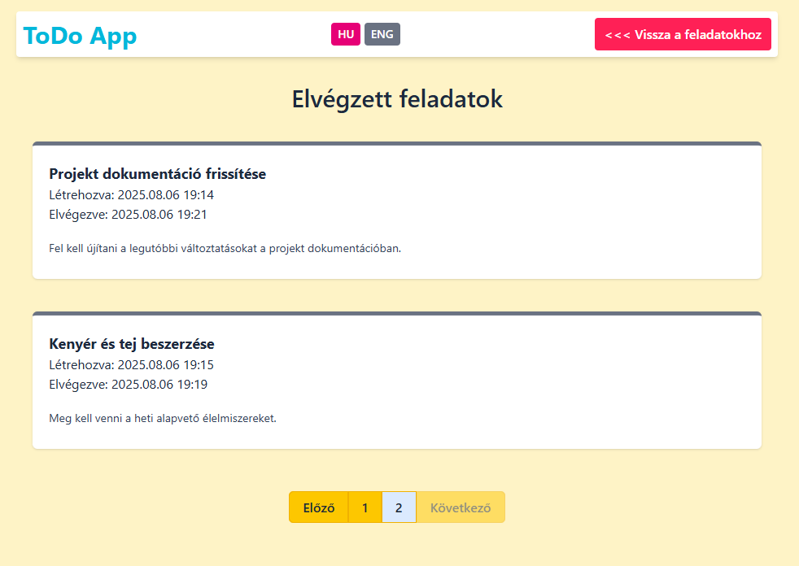

# laravel-todo-app
Laravel Todo alkalmazás alap CRUD funkciókkal, újrahasználható Blade komponensekkel és SQLite adatbázissal autentikáció nélkül.

## Telepítés
1. Klónozd a repót
2. Telepítsd a függőségeket
    `composer install`
3. Másold az `.env.example`-t és nevezd át`.env`-re
4. Generáld az app kulcsot
    `php artisan key:generate`
5. Migráld az adatbázist
    `php artisan migrate`
6. Futtasd a seedereket a teszt adatok feltöltéséhez
    `php artisan db:seed`
7. Telepítsd a nodejs csomagokat
    `npm install`
8. Indítsd el a Vite fejlesztői szervert
    `npm run dev`
9. Indítsd el a szervert:
    `php artisan serve`

## Funkciók
- Alap CRUD műveletek feladatokhoz
- Blade sablonok és komponensek használata
- Többnyelvűség támogatása a Laravel lokalizációs rendszerével
- Flash üzenet megjelenítése a művelet sikerességének visszajelzésére
- Form validáció
- Oldalszámozás
- Seederek használata teszt adatokhoz

## Használt technológiák
- PHP
- Laravel
- Blade templating és komponensek
- Tailwind CSS

## Képek

*Feladatok három oszlopba rendezve fontosság szerint*

*Új feladat hozzáadása (megegyezik a szerkesztéssel)*

*Elvégzett feladatok listája lapozással*

